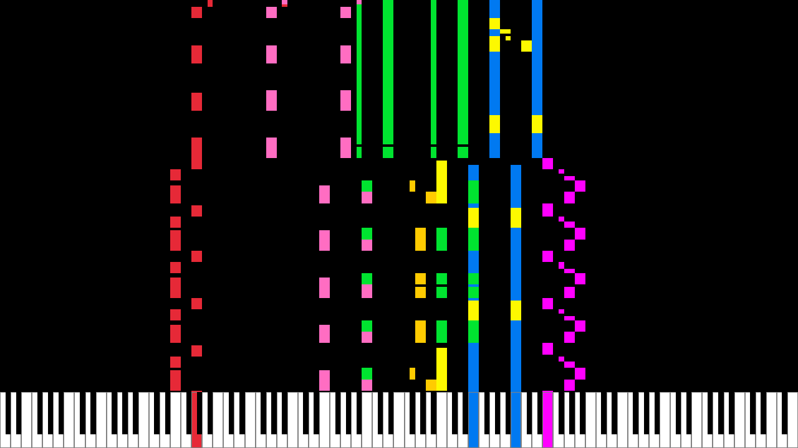

# Midi Visualizer
Visualizer for midi files written in rust. The program reads in midi events from a given file and generates sound using basic waveforms. Then, the generated music track is played back while the notes are displayed on screen using raylib.



## Quick Start
```console
$ cargo run [input.mid] [output.wav]
```